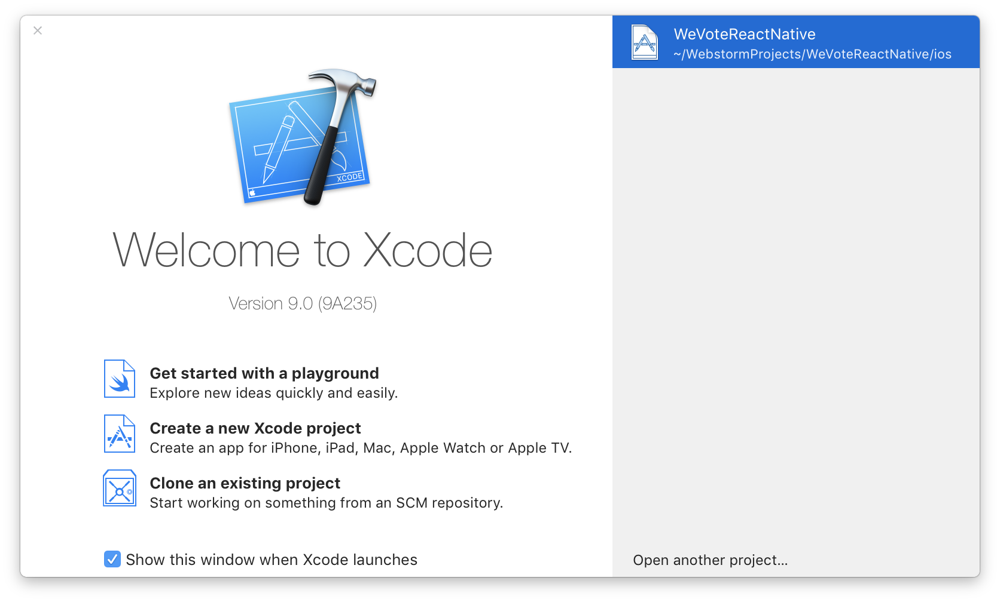

# Preparing the Environment on Your Machine
[Go back to Readme Home](../../README.md)

## Install nodeenv ("Node Env")

Install nodeenv globally. For instructions installing it locally, see: https://github.com/ekalinin/nodeenv

    $ cd ~
    $ sudo pip install nodeenv

Create a place for your We Vote React Native virtual environment to live on your hard drive. (If you have already installed
the We Vote WebApp you should be able to use the existing environment you set up for that.) We recommend installing it
away from the WeVoteReactNative source code:

    $ mkdir /Users/<YOUR NAME HERE>/NodeEnvironments/
    $ cd /Users/<YOUR NAME HERE>/NodeEnvironments/

Now create a new virtual environment in that 'NodeEnvironments' folder. This can take many minutes.

    $ nodeenv WebAppEnv

Now activate this new virtual environment:

    $ cd /Users/<YOUR NAME HERE>/NodeEnvironments/WebAppEnv/
    $ . bin/activate

Confirm the versions of your main packages are >= to these versions:

    (WebAppEnv) $ node -v
    v6.3.1

    (WebAppEnv) $ npm -v
    3.10.5

IF you find that your node or npm versions are below that, run this command:

    (WebAppEnv) $ sudo npm install -g npm
    (WebAppEnv) $ npm rebuild node-sass
    (WebAppEnv) $ brew unlink node
    (WebAppEnv) $ brew install node

Many of the instructions below come from the React Native
[Getting Started](https://facebook.github.io/react-native/docs/getting-started.html) page.
We recommend referencing starting there. The notes that follow here are to supplement the Getting Started page.

## iOS

### Install Xcode

The easiest way to install Xcode is via the
<a href="https://itunes.apple.com/us/app/xcode/id497799835?mt=12" target="_blank">Mac App Store.</a>  The Xcode.app download is 10gb in size.

### Node, Watchman, React Native command line interface

We recommend installing node and watchman via Homebrew.

    brew install node
    brew install watchman

Node comes with npm, which lets you install the React Native command line interface.

    npm install -g react-native-cli

If you get a permission error, try with sudo: `sudo npm install -g react-native-cli`.

### iOS specific setup
 

Be sure to open **`/Users/<YOUR NAME HERE>/MyProjects/WeVoteReactNative/ios/WeVoteReactNative.xcworkspace`** each time, if
you forget the compile will fail, since you won't have referenced the cocopods (a dependency manger, that pulls in some iOS 
specific libraries.)

Be sure to NOT open ~~`/Users/<YOUR NAME HERE>/MyProjects/WeVoteReactNative/ios/WeVoteReactNative.xcodeproj`~~ with Xcode, 
and don't pick one out of the history in the Welcome to Xcode dialog.  The history unfortunately only contains contains 
references to .xcodeproj files.

And in the "Welcome to Xcode" dialog, don't pick anything from the history list (those are all xcodeproj files), you have to
click "Open another project..." and navigate to the 'WeVoteReactNative.xcworkspace' item (which is actually a directory).
    
#### The following may not be necessary for developers who don't need to add libaries that contain ObjectiveC 

The installation of these components may have been captured by the `ios/Podfile` and the `ios/WeVoteReactNative/Info.plist`, 
until a new volunteer starts working on this, and gets it going from scratch, we won't know for sure.

If you will need to add additional libraries that bridge JavaScript/ObjectiveC, you will need to install cocoapods

    sudo gem install cocoapods
    
Then install Cocoapods Specs    

    cd ~/.cocoapods/repos 
    git clone https://github.com/CocoaPods/Specs.git master
    
    cd ~/MyProjects/WeVoteReactNative/ios
    
Next run react-native link.  Do not overwrite the source controlled `ios/Podfile`, it has been 
hand coded and is necessary for authentication to Twitter and Facebook.

    react-native link react-native-oauth
    
A successful run looks like this (in my case re-running the previous Podfile):

    (WebAppEnv)Steves-MacBook-Pro-2017:WeVoteReactNative stevepodell$ react-native link react-native-oauth
    Scanning 611 folders for symlinks in /Users/stevepodell/WebstormProjects/WeVoteReactNative/node_modules (4ms)
    Preparing to link react-native-firestack for iOS
    Checking CocoaPods...
    CocoaPods already installed
    rnpm-install info Android module react-native-oauth is already linked 
    rnpm-install info iOS module react-native-oauth is already linked 
    Checking Podfile in iOS project (/Users/stevepodell/WebstormProjects/WeVoteReactNative/ios/Podfile)
    
    Found an existing Podfile, Do you want to override it? [N/y]
    n
    Add the following pods:
    
    
    source 'https://github.com/CocoaPods/Specs.git'
    platform :ios, '8.0'
    use_frameworks!
    
    pod 'DCTAuth', :git => 'https://github.com/danielctull/DCTAuth.git'
    
    
    and run 'pod install' to install OAuth for iOS
    (WebAppEnv)Steves-MacBook-Pro-2017:WeVoteReactNative stevepodell$ 

Then run `pod install`

    (WebAppEnv)Steves-MacBook-Pro-2017:ios stevepodell$ pod install
    Analyzing dependencies
    Fetching podspec for `React` from `../node_modules/react-native`
    Fetching podspec for `Yoga` from `../node_modules/react-native/ReactCommon/yoga`
    Fetching podspec for `react-native-fbsdk` from `../node_modules/react-native-fbsdk/ios`
    Fetching podspec for `react-native-fbsdkcore` from `../node_modules/react-native-fbsdkcore`
    Fetching podspec for `react-native-fbsdklogin` from `../node_modules/react-native-fbsdklogin`
    Fetching podspec for `react-native-fbsdkshare` from `../node_modules/react-native-fbsdkshare`
    Downloading dependencies
    Installing Bolts (1.8.4)
    Using DCTAuth (3.0)
    Installing FBSDKCoreKit (4.27.1)
    Installing FBSDKLoginKit (4.27.1)
    Installing FBSDKShareKit (4.27.1)
    Installing React (0.47.2)
    Installing Yoga (0.47.2.React)
    Installing react-native-fbsdk (0.6.3)
    Installing react-native-fbsdkcore (0.0.8)
    Installing react-native-fbsdklogin (0.0.8)
    Installing react-native-fbsdkshare (0.0.8)
    Generating Pods project
    Integrating client project
    Sending stats
    Pod installation complete! There are 11 dependencies from the Podfile and 11 total pods installed.
    (WebAppEnv)Steves-MacBook-Pro-2017:ios stevepodell$ 

**Clean Build:**

You probably will run into the need to "Clean Build Folder".  To do this in XCode, go to the Product menu, hold down the Option button 
(on your Mac) and select "Clean Build Folder", after it completes (about 10 seconds), press the triangular
Run (Play) button do to a full rebuild

## Android

Go to [Facebook React Native Getting Started](https://facebook.github.io/react-native/docs/getting-started.html) and
click on the "Android" button. Steps described include:

- Downloading the latest Java SE Development Kit
- Install Android Studio

There is lots of info on our wiki at [Android Cheat Sheet](https://github.com/wevote/WeVoteReactNative/wiki/Android-Cheat-Sheet)

  *NOTE: Android Studio can take a significant amount of hard drive space. The amount ranges
  but it appears to be common for the SDK and Studio to take up 20-30gb.  On top of this, running the emulator can
  also consume a great deal of hard drive and memory resources.  It appears that one should try to have 40gb free
  drive space in order to successfully install and emulate a project. This [post](https://stackoverflow.com/questions/30796230/android-sdk-folder-taking-a-lot-of-disk-space-do-we-need-to-keep-all-of-the-sys)
  has some advice on how to mitigate the problem but would require emulation through a connected Android mobile device.*

## Get ready to retrieve WeVoteReactNative code

Create a place to put all of the code from Github:

    $ mkdir /Users/<YOUR NAME HERE>/MyProjects/

---

Next: [Bringing Code to Your Machine](CLONING_CODE.md)

[Go back to Readme Home](../../README.md)
